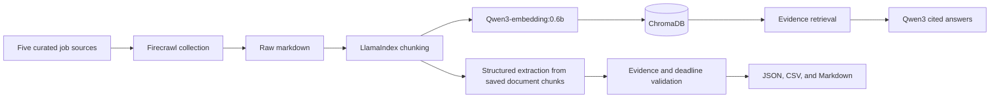

# Private Research Assistant

A CLI research assistant for discovering AI/ML PhD advertisements from curated Europe/UK sources, extracting fields with source references, and answering questions over a local vector index.

Hosted Firecrawl collects public pages. Ollama runs Qwen3 and qwen3-embedding:0.6b embeddings locally; LlamaIndex handles chunking and retrieval, and ChromaDB stores the vector index. Python validators check extracted excerpts, deadlines, and answer citation IDs.

## Architecture



Raw crawl data and the vector database stay on the local machine and are excluded from Git. Firecrawl is the only hosted component in the current workflow.

## Capabilities

- Collect public web evidence from curated sources.
- Parse and index retrieved text.
- Extract structured opportunities with citations.
- Generate answers using retrieved context and check returned citation IDs.
- Check that extracted values match normalized excerpts in cited chunks.

Unsupported values become `unknown`. Unsupported page formats are skipped by default.

## Setup

Requires Python 3.12+, uv, and Ollama for the live RAG path. The offline demo
uses only Python's standard library and needs no API key or model download:

```bash
PYTHONPATH=src python3 -m private_research_assistant demo
```

```bash
uv venv
uv sync
cp .env.example .env
```

Edit `.env` and add your Firecrawl API key.

Pull the two local models:

```bash
ollama pull qwen3:1.7b
ollama pull qwen3-embedding:0.6b
```

Then check readiness:

```bash
uv run pra setup-check
```

## Workflow

```bash
uv run pra crawl
uv run pra index
uv run pra extract
uv run pra ask "Which active AI PhD opportunities are fully funded?"
uv run pra eval
```

To extract and validate an existing indexed crawl:

```bash
uv run pra status
uv run pra extract
uv run pra inspect opportunities
uv run pra eval --live
```

To inspect saved artifacts and retrieved context:

```bash
uv run pra status
uv run pra inspect raw --limit 3
uv run pra inspect chunks --query "fully funded" --limit 3
uv run pra ask --show-context "Which active AI PhD opportunities are fully funded?"
```

For a repeatable local test that does not use Firecrawl or Ollama:

```bash
PYTHONPATH=src python3 -m unittest discover -s tests
```

## CLI Commands

- `pra setup-check` checks Python, disk space, Ollama, required models, Firecrawl key, and AI dependencies.
- `pra crawl` searches the five curated public sources and stores raw markdown locally.
- `pra index` chunks the raw crawl output and indexes it into ChromaDB with local Ollama embeddings.
- `pra extract` produces an opportunity table using a structured parser for supported advert pages. The experimental `--llm-fallback` option enables local model extraction for other pages.
- `pra ask "<question>"` retrieves evidence and answers with chunk/source citations.
- `pra eval` runs ten saved-answer fixture consistency checks, not a RAG accuracy benchmark. Add `--live` to check textual support in the latest extraction.
- `pra demo` runs the real parser and validator on synthetic, split-chunk adverts offline.
- `pra status` shows whether crawl, index, and extraction artifacts exist.
- `pra inspect raw|chunks|opportunities` displays saved pipeline artifacts.

## Data Flow

1. `pra crawl` asks Firecrawl to search the curated source sites and save page text under `data/raw/`.
2. `pra index` splits that text into smaller chunks, gives each chunk an evidence id, embeds each chunk with Ollama, and stores the vectors in ChromaDB.
3. `pra ask` embeds your question, retrieves similar chunks from ChromaDB, and gives only those chunks to Qwen3.
4. `pra extract` reads the indexed chunks and fills a structured opportunity table from known page formats, with optional Qwen3 fallback for harder pages.
5. Extraction retains only values matching normalized text in cited chunks (URLs may match source metadata or links). Other values become `unknown`; rows without a supported title are excluded.
6. `pra eval` compares saved fixture answers with expected values and references. `--live` additionally checks excerpts and deadlines in the latest extraction.

## Evaluation Results

The saved crawl dated 2026-09-04 contains 37 documents and 375 evidence chunks.
Re-extraction on 2026-09-05 returned 2 opportunities with matching source excerpts,
active as of the crawl date. All 28 unit tests and 10/10 saved-answer fixture
consistency checks passed. The synthetic offline demo executes the actual parser
and validator. These results do not measure overall RAG answer accuracy.

A local smoke check on 2026-09-05 retrieved the Newcastle advert as the top
result and returned its stated GBP 21,805 allowance plus 100% home fees with a
matching citation. Manual review confirmed the funding excerpt but found
additional sentences without individual citations. This single check does not
establish end-to-end answer accuracy.

Example extracted rows:

| Title | Institution | Country | Deadline | Funding |
| --- | --- | --- | --- | --- |
| PhD Scholarship in Human Navigation, Artificial Intelligence and Neuroscience for Human-Centric Urban Mobility | Technical University of Denmark | Denmark | 15th September 2026 | Based on Danish collective agreement; open to UK, EU, and international students |
| PhD Studentship in Computer Science: Policy-Compliant Secure AI | Newcastle University | unknown | 10th October 2026 | £21,805 tax-free annual living allowance plus 100% home fees covered |

## Current Limitations

- Textual support checks verify excerpt presence, not factual truth or whether an excerpt refers to the correct vacancy. Review original adverts before applying.
- Answer checks require citations and reject IDs outside retrieved context; they do not verify every claim's meaning. Unverified answers are withheld with a clear message.
- Missing/rolling deadlines are allowed by policy, not confirmed open. Invalid deadlines are excluded. Results describe crawl-date snapshots, not current availability.
- Countries require explicit country text. Source selection targets Europe/UK but does not guarantee geographical coverage or completeness.
- Shortened context and small local models can miss relevant evidence. Optional LLM extraction remains experimental.
- The reliable structured extractor currently targets clean `jobs.ac.uk` advert pages. Other source formats are collected and searchable but often skipped during table extraction.
- Firecrawl collection requires a hosted API key, although model inference, embeddings, indexing, retrieval, and evaluation run locally.
- Live advertisements change, so fixture evaluation and live validation are reported separately.

## Curated Sources

The first version searches:

- jobs.ac.uk
- FindAPhD
- EURAXESS
- Academic Positions
- ELLIS jobs
-PhD Scanner

Collection is restricted to these configured sources; coverage depends on source availability and page format.

## Data Policy

Live crawl data, Chroma indexes, model files, credentials, generated outputs, caches, and local notes are excluded from Git. The repository contains source code, synthetic demo inputs, evaluation fixtures, tests, documentation, and dependency metadata.

## Repository Layout

```text
src/private_research_assistant/
  crawl.py                  Collect public source pages
  indexing.py               Chunk, embed, and store evidence
  retrieval.py              Retrieve chunks and answer with citations
  extraction.py             Produce evidence-backed opportunity rows
  structured_extractors.py  Parse supported advert formats
  evaluation.py             Run fixture and live validation
tests/                       Unit tests for the evidence pipeline
```

## Future Work

Version 0.1 uses explicit CLI stages. Planned extensions include autonomous tool
selection with execution traces and stopping criteria, additional source parsers,
and an end-to-end retrieval and answer evaluation set.

## License

Released under the MIT License.
